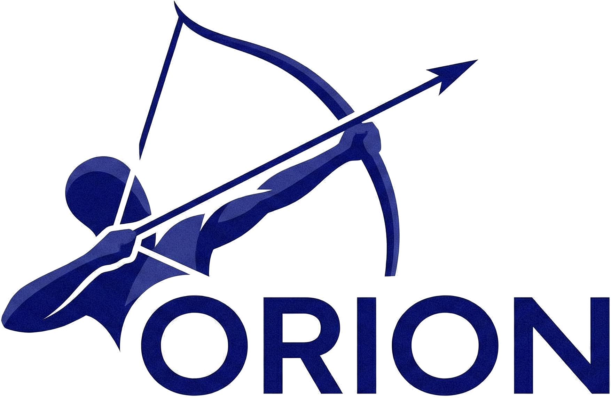

# orion - PostgreSQL cluster manager



Orion is a cluster manager for PostgreSQL cluster toplogies. 
It is cloud native because by nature (Loosely Coupled, Microservice oriented, scalable, resilient, observable, etc.).
You can run Orion on Virtual Machines, and K8s environemts.

## Features

* Leverages PostgreSQL physicl and logical streaming replication.
* Resilient to any kind of partitioning. While trying to keep the maximum availability, it prefers consistency over availability.
* [kubernetes integration](examples/kubernetes/README.md) letting you achieve postgreSQL high availability.
* Uses a cluster store like [etcd](https://etcd.io), [consul](https://www.consul.io) or kubernetes API server as an high available data store and for leader election
* Asynchronous (default) and [synchronous](doc/syncrepl.md) replication.
* Full cluster setup in minutes.
* Easy [cluster administration](doc/orion-cli.md) with the api nd cli.
* Can do point in time recovery integrating with your preferred backup/restore tool.
* [Standby cluster](doc/standbycluster.md) (for multi site replication and near zero downtime migration).
* Automatic service discovery and dynamic reconfiguration (handles postgres and orion processes changing their addresses).
* Can use [pg_rewind](doc/pg_rewind.md) for fast instance resynchronization with current master.

## Architecture

Orion is composed of the following main components

* keeper: it manages a PostgreSQL instance converging to the clusterview computed by the leader sentinel.
* sentinel: it discovers and monitors keepers and proxies and computes the optimal clusterview.
* proxy: the client's access point. It enforce connections to the right PostgreSQL master and forcibly closes connections to old masters.
* api: Manage Orion clusters with a restful API
* cli: consume the api in an easy way

For more details and requirements see [Orion Architecture and Requirements](doc/architecture.md)


## Documentation

[Documentation Index](doc/README.md)

## Installation

## Quick start and examples

* [Simple cluster example](doc/simplecluster.md)
* [Kubernetes example](examples/kubernetes/README.md)
* [Two (or more) nodes setup](doc/twonodes.md)

## Project Status

Orion is under active development and used in different environments. Probably its on disk format (store hierarchy and key contents) will change in future to support new features. If a breaking change is needed it'll be documented in the release notes and an upgrade path will be provided.

Anyway it's quite easy to reset a cluster from scratch keeping the current master instance working and without losing any data.

## Requirements

* PostgreSQL 15, 14, 13, 12, 11, 10, 9.6
* etcd2 >= v2.0, etcd3 >= v3.0, consul >= v0.6 or kubernetes >= 1.8 (based on the store you're going to use)

* OS: currently orion is tested on GNU/Linux (with reports of people using it also on Solaris, *BSD and Darwin)

## build

To build orion we usually test and support the latest two major versions of Go like in the [Go release policy](https://golang.org/doc/devel/release.html#policy).

```
make
```

## High availability

Orion tries to be resilient to any partitioning problem. The cluster view is computed by the leader sentinel and is useful to avoid data loss (one example over all avoid that old dead masters coming back are elected as the new master).

There can be tons of different partitioning cases. The primary ones are covered (and in future more will be added) by various [integration tests](tests/integration)

## FAQ

See [here](doc/faq.md) for a list of faq. If you have additional questions please ask.

## Contributing to orion

orion is an open source project under the Apache 2.0 license, and contributions are gladly welcomed!
To submit your changes please open a pull request.

## Contacts

* For bugs and feature requests file an [issue](https://github.com/pgvillage-tools/orion/issues/new/choose)
